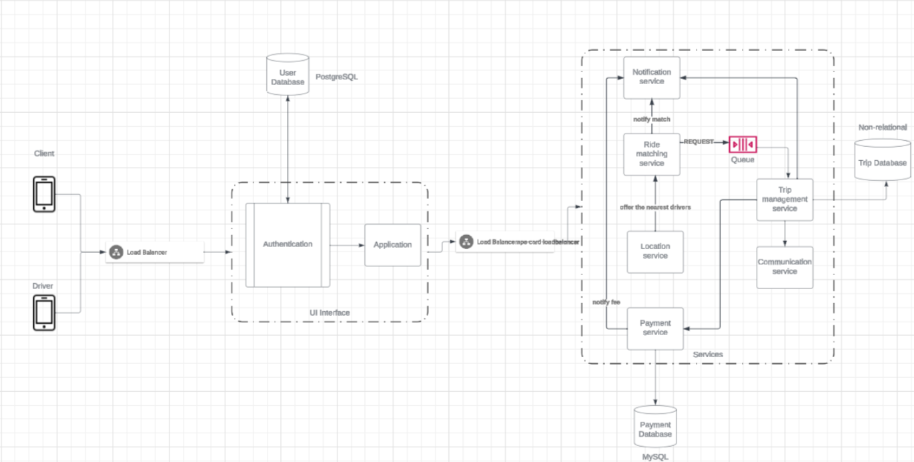

# 1. Design the system components of a drive sharing application (ex: Uber, Lyft). Specify what elements are necessary for this application to work. 

## 1.1	 Your design must include a block diagram of each of the components to have the application needs to operate. 

 

## 1.2	 In your design, you must provide a list of the data that you need to collect for the operation of the application. For each, provide a description of why you need this data. Examples: 

- Client User: We need name, location, email, password , phone number and payment methods from the client. It is important to identify users and facilitate transactions securely 

- Driver User: We need the profile which has the name, picture, car plate, email, password, phone number and location.  

- Location Service: Collect the Real-time GPS coordinates. It is important because it manages real-time location tracking of drivers and riders for efficient pairing and use algorithms to find the best and fastest route.  

- Payment Service: In this part is necessary the payment information from the client so that they can pay and information from the driver so that they can obtain their transaction. This part is crucial as it facilitates secure payment transactions between users and drivers. 

- Communication system: Phone number and profile page. Allows users to rate and review drivers and viceversa. Also provides a chat between users so that they can maintain communication. 

- Matching service: Uses location from both users, user preferences, user payment method, users profile information. This is important because is the base functionality of the application.  

## 1.3 	Include a privacy design for the application. 

- Collect only the data that is strictly necessary for the operation of the service and periodically review it so that it remains relevant and essential. 

- Communicate to users what data is being collected and why. Obtain explicit consent from users before collecting sensitive information. 

- Implement robust encryption measures to protect user data and address potential risks. 

- Implement strict access controls to limit who can access user data within the organization. 

- Develop and document an incident response plan to address any potential bad incident related to their personal information being leaked. 

- Provide users with tools to control their privacy settings and manage their personal information in their profile page. 

- Stay informed about changes in privacy laws and update the application accordingly. 

- Third parties managing secure payment methods. 

## 1.4	Assume you are a pen-tester and you are in charge of testing the privacy design proposed. 

What are the risks if you are able to get access to the app as a user, as an admin, and as developer? 

- Access as a user: Dangerous person accessing to my location. When using credit card, not being able to know exactly how much they will take from it before the payment.  

- Access as an admin: Unauthorized Data Access can cause disturbance between users and potential lawsuits  

- Access as a developer: Exploiting code vulnerabilities to perform injection attacks, potentially gaining unauthorized access to databases or sensitive information 

In any of these cases, what are the ways that an attacker can provoke a privacy breach? What kind of attacks can be used to accomplish this. 

- Account Takeover: Attackers can exploit weak passwords by employing various techniques such as brute force attacks, dictionary attacks, or credential stuffing. These methods involve systematically attempting different combinations of usernames and passwords until the correct combination is found, allowing unauthorized access to user accounts and, consequently, their payment information. 

- SQL Injection: Attackers provoke a privacy breach by injecting malicious SQL queries into the app's input fields. This involves manipulating the input data to execute unauthorized SQL commands, potentially gaining access to sensitive information stored in databases. Common techniques include appending malicious code to user inputs, thereby tricking the application into executing unintended database queries. 

- Code Injection: Privacy breaches through Code Injection occur when attackers insert malicious code into the app's codebase. This can be achieved through exploiting vulnerabilities in the app's input validation or utilizing insecure API calls. The injected code can manipulate the app's behavior, compromising the integrity of its functions and potentially leading to unauthorized access or data manipulation. 

- Credential Brute Force: Attackers attempt a privacy breach by repetitively trying different combinations of usernames and passwords to gain unauthorized access to admin credentials. This method relies on the assumption that weak or easily guessable passwords are in use. Once successful, the attacker gains control over admin accounts, posing a threat to user privacy and the overall security of the app. 

Write an ethical analysis of the consequences of a privacy breach of the app for each of the cases above. 

- Account Takeover: The ethical implications of an Account Takeover extend beyond a mere breach of user trust, it violates the expectations users have regarding the privacy of their personal information. This breach has the potential to inflict financial harm on users, particularly as their payment information becomes compromised. The app, as a custodian of user data, carries the responsibility to safeguard this sensitive information, and failing to do so raises ethical concerns. 

- SQL Injection: The consequences of SQL Injection transcend the exposure of sensitive data; it creates a pervasive sense of insecurity among users in their digital surroundings. From an ethical standpoint, this breach not only erodes user trust but also raises legal concerns, as the app is duty-bound to protect the integrity of user data. 

- Code Injection: Introducing malicious code through Code Injection not only jeopardizes the security of the app but also has ethical implications. The potential disruption of service directly impacts users' safety while utilizing the ride-sharing app. The app's ethical responsibility lies in ensuring the reliability and safety of its service, making any compromise a breach of that responsibility. 

- Credential Brute Force: A breach resulting from Credential Brute Force has a deep impact on user privacy and trust. The ethical dimensions of this breach involve the inadequate protection of admin credentials, highlighting a failure in the app's security measures. Users entrust the app with their data, and any compromise in the protection of this information raises ethical concerns, affecting the overall integrity of the platform. 

# 2. Your drive sharing company has decided to sell users data to advertisers.  

## You have been asked to loosen up your design so that data can be sold to advertisers. Additionally, your manager has asked you to provide a list of data that can be sold, so the advertisers can maximize the accuracy of the ads. 

- Location Data: General geolocation data, for example the city where the user is located or region. This helps in regional targeting while maintaining user privacy. 

- Heatmaps of activity: The areas with high ride can be a powerful tool for business by providing a visual representation of where potential customers are most concentrated.  

- Payment Methods: Type of payment methods used and average spending on trips can indicate a user’s economic bracket.  

- Ride preferences: Choice of ride type can either be economic, premium, or any special accommodations requested. By analyzing this data, a company can gain insights into customer preferences and behavior. 

- Device information: The type of device used (such as smartphone or tablet), the operating system it runs, and the patterns of app usage. 

- Demographic data: Demographic information includes the age range, gender, and occupation of users, focusing on providing a general distribution of age groups and general patterns in distribution of genders without revealing individual ages or specific occupations. 

- Promotional Interests: Promotional preferences encompass users opted-in interests for promotions, specifying their preferred types such as discounts and rewards. 

## Provide the details of the new privacy design following the same principles you used for the original design. 

 
- Continue to collect only essential data, with an emphasis on anonymizing data if possible. Also, it is important to conduct regular audits to ensure that all collected data remains necessary for service operation. 

- Update privacy policies to be more user-friendly, using clear language. Ensure that users are informed of any changes in data collection practices and obtain renewed consent every time the policies are updated. 

- Maintain the upgrade of encryption technologies to stay ahead of constantly cybersecurity threats. It is important to regularly assess potential risks, especially concerning new features or changes in the app. 

- Implement more granular access levels within the organization to ensure that employees only access data necessary for their role. And, simultaneously, apply regular training for staff on data privacy and security protocols. 

- Update the incident response plan to include new types of data breaches or leaks. In parallel conduct regular drills and simulations to ensure that the team is well prepared and can efficiently respond to a potential incident. 

- To enhance user privacy and control, it is crucial to provide intuitive user interface with easier control over privacy settings. Alongside this, providing users with a comprehensive log of how their data has been used historically can improve transparency. 

- Regularly audit third-party payment processors for compliance with the latest security standards. Additionally implement security measures such as two-factor authentication for transactions. 
 

## Repeat the pen-tester exercise done for the original design. 

What are the risks if you are able to get access to the app as a user, as an admin, and as developer? 

- User access risks 

Regular users have the least access, but they can still face problems. They might not understand how to use privacy settings well, which could let their personal information get out. There's a chance that someone could use their personal information wrongly, especially if the app doesn't explain clearly how they use this information. If the app uses other companies to handle payments, there's a risk that these companies might not be totally safe, putting users' money information at risk. Also, users might fall for scams that trick them into giving away their information. 

- Admin access risks 

Admins can do more things in the app and see more information, so the risks are bigger. If an admin does something wrong or if someone else gets into their account, it could cause a big problem, like a lot of information getting out. Even if the app tries to make sure admins only see what they need to, there could still be mistakes or things they didn't think about. Admins can also accidentally cause problems, like letting information leak, even though they know a lot about how to keep information safe. 

- Developer access risks 

Developers can do the most in the app. They can change how the app works and see all the information in it. This means if they make a mistake or do something bad on purpose, it could be really serious. They can see and change the secret parts of the app, so if someone else gets into their account, it could lead to a big leak of information. Developers are also important for keeping the app safe from hackers, but if they don't update the app's security or don't follow rules about keeping information safe, it could cause problems. 

## In any of these cases, what are the ways that an attacker can provoke a privacy breach? What kind of attacks can be used to accomplish this. 

- Data Minimization: Potential attackers can exploit data that is collected but no essential for the operation of the service. 

- Up-to-Date Encryption: Attackers may attempt to exploit security weaknesses in the encryption methods used or take advantage of vulnerabilities in the system. 

- Payment Data Theft: Exploiting vulnerabilities in the payment service to gain unauthorized access to users payment information. 

- Fair Pairing System: Manipulation the ride matching service to facilitate unauthorized pairing or access to user profiles. 

## Write an ethical analysis of the consequences of selling this data to advertisers. 

Selling people's data to advertisers raises big ethical concerns, mainly about privacy, getting permission, trust, and the risk of misusing the information. Usually, people want their private information to be kept safe and confidential. The sale of data by an app to advertisers can be viewed as a breach of trust, especially if users are not transparently informed about such practices. Therefore, obtaining user consent is imperative. 

Ethical rules say that people should be clearly told how their information is used and they must agree to it, especially if their information is being sold. Also, there's a problem with keeping data safe. When information about users is given to other companies, there's a bigger chance that this data might be stolen or accessed without permission, which could reveal private details about people. 

Another important point is that advertisers might use this data in a way that is unfair or biased. They could use information about people to target certain groups more than others. This can lead to unfair advertising where some people get more attention than others, or it could even strengthen existing unfair ideas in society. 

In conclusion, selling people's data to advertisers might make money for companies, but it comes with many ethical problems. These problems include protecting user privacy, making sure users really understand and agree to what's happening, fairly sharing any benefits, keeping the data safe, and avoiding unfair treatment. Companies need to think carefully about these issues and follow ethical guidelines to keep the trust and respect of their users. 

 

 
